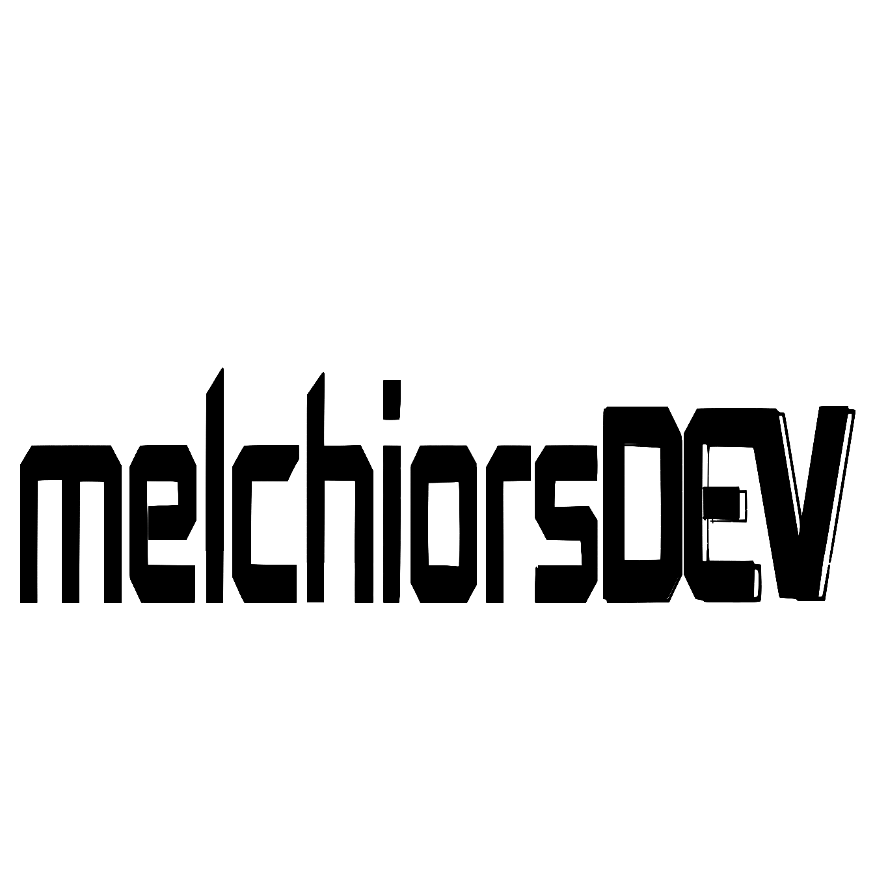

# **Projeto Portifólio**

## Tecnologias

-   typescript
-   workflow n8n
-   next
-   nestjs
-   prisma
-   supabase
-   monorepo create with `npx concurrently`

`codigo` em linha

```javascript
function modelo() {
	console.log("modelo");
}

modelo();
```

_italico_
_italico_
**negrito**
**negrito**

_**NegritoComItalico**_

para acessar o google
[clique aqui](https://google.com)


Escrever textos
<br/>


<div align="center">
    <p> olas esse é um texto</p>
</div>

Estrutura do Readme

-   apresentar
-   documentar
-   explicar como contribuir
-   divulgar

Awesome Readme (lista de readme legais)

um cheklist

-   titulos com emoji
-   sessoes sobre o que é o projeto
-   sessão de como rodar o projeto
-   Como usar o projeto após estar rodando
-   link uteis, que foram usados durante a construção do projeto.
-   gif do proejto rodando
-   no cabeçalho
    -   imagem do projeto
    -   tags do repositorios
    -   tags de tecnologia

[repositorio para badges - badges4-readme.md-profile](https://github.com/alexandresanlim/Badges4-README.md-Profile)

[site para tags (badges) = shields.io](https://shields.io/)
