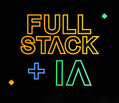
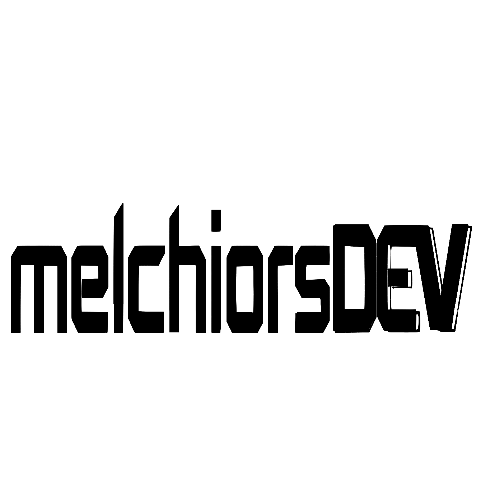

# Portifolio - JoaoMelchiors

<div align="center">

</div>

<div data-badges align="center">


</div>

<div data-badges align="center">


</div>

## Sobre o projeto

O projeto é uma aplicação full stack que reúne tecnologias amplamente utilizadas no mercado para criar uma vitrine digital das habilidades e projetos de um desenvolvedor. Mais do que apenas exibir trabalhos anteriores, a plataforma funciona como uma demonstração prática do domínio técnico do profissional, evidenciando sua experiência em desenvolvimento web moderno.

Um dos destaques da aplicação é a integração de agentes de inteligência artificial que têm acesso completo ao currículo, repositórios do GitHub e histórico profissional do desenvolvedor. Por meio de interações em tempo real via chat, recrutadores e clientes podem explorar aspectos específicos das competências técnicas do profissional. Esses agentes oferecem respostas detalhadas e contextualizadas, tornando a avaliação mais dinâmica, interativa e informativa.

## Como executar

1. Clone este repositório

```sh
git clone https://github.com/joaomelchiors/proj-portifolio.git
```

2. Acesse o diretório do projeto

```sh
cd proj-portifolio
```

3. Acesse sua conta no [Supabasa] (https://supabase.com) ou crie uma conta.

4. Navegue até o projeto no Supabase e clique no botão `connect`.

5. Clique em selecionar ORM e selecione o ORM Prisma.

6. Copie as variáveis de ambiente listadas e crie um arquivo `.env` na pasta backend e preencha com as seguintes informações:

    ```
    DATABASE_URL=
    DIRECT_URL=
    ```

    **Obs: Caso o valor da porta não seja adicionado, a aplicação rodará por padrão na porta 4000.**

7. Instale o docker.

8. Conceder acesso de leitura e gravação na pasta ./n8n_data para o user **(UID 1000)**

    ```sh
    sudo chown -R 1000:1000 ./n8n_data
    ```

9. Acesse a pasta:

```sh
cd infra
```

11. Execute o docker compose.

    ```sh
    docker compose up
    ```

12. Abra o navegador vá para a url: **localhost:5678**

13. Navegue até o proejto e em seguida entre em webhook, copie o path.

14. Crie um arqquivo `.env` no frontend e preencha o atributo `NEXT_PUBLIC_CHAT_WEBHOOK=` com o endereço **http://localhost:5678/webhook/** seguido do **"path copiado do n8n"**

    ```
    NEXT_PUBLIC_API_URL=http://localhost:4000
    CHAT_WEBHOOK=http://localhost:5678/webhook/
    ```

15. Instale as depedências em cada uma das pastas, usando o comando `npn -i`

16. Na pasta raiz digite `npm run dev`

## Features do projeto

-   Exibição de Projetos
-   Integração com Agentes de IA
-   Repositorio GitHub Integrados
-   Lista de Tecnologias destacadas
-   Lista de Tecnologias dos projetos
-   Buscar os Projetos pr ID com as Tecnologias
-   Chat flutuante

## Links úteis

-   [Nest.js](https://nextjs.org/docs)
-   [NestJS](https://docs.nestjs.com/)
-   [Prisma](https://www.prisma.io/docs)
-   [Supabase](https://supabase.com/)
-   [Docker/intall/ubuntu](https://docs.docker.com/engine/install/ubuntu/)

##


